# Day1ハンズオン

## 1.事前準備

Oracle Functionsを利用する上で、必要な事前準備を行います。

### 1-1.OICDの確認

OCIR(Oracle Functionsを管理するOracle提供のプライベートDockerレジストリ)にログインするための認証tokenを作成します。

作成の上で必要となる情報を取集します。

画面左上にあるハンバーガーメニューをクリックして、「アイデンティティとセキュリティ」-「コンパートメント」を選択します。

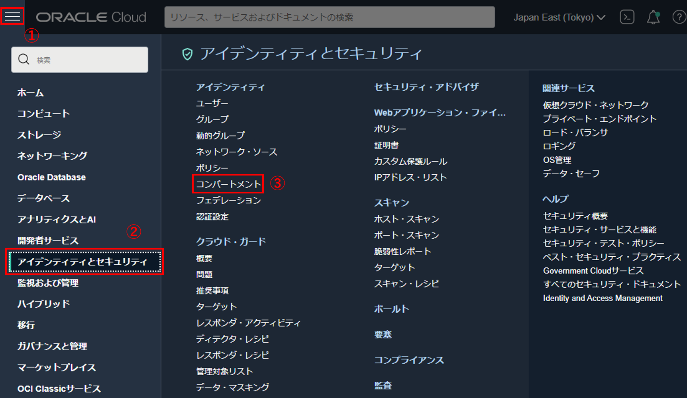

`HandsOn` を選択します。

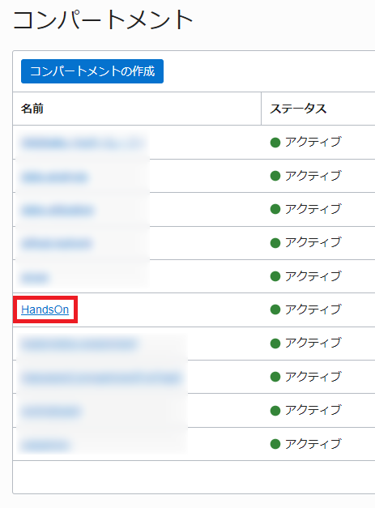

「hands-on-<ご自身の苗字>」のコンパートメントを選択します。

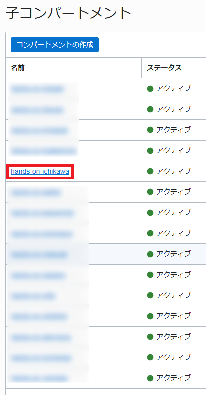

「コンパートメント情報」にある「OCID」の「コピー」テキストをクリックして、クリップボードにコピーします。

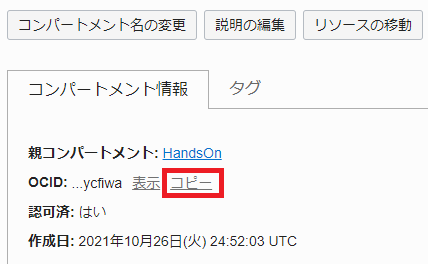

コピーした内容は、テキストエディタなどにペーストしてください。

### 1-2.認証トークンの作成

画面右上の人型のマークが表示されている箇所をクリックします。さらに、展開されたメニューのユーザー名部分をクリックします。

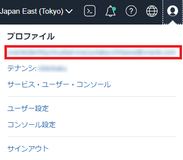

画面左下にある「認証トークン」をクリックします。

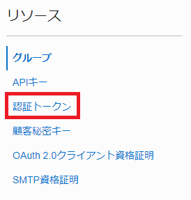

「トークンの生成」ボタンをクリックします。

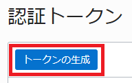

「説明」に `This token is used for Oracle Functions Handson` と入力して、「トークンの生成」ボタンをクリックします。

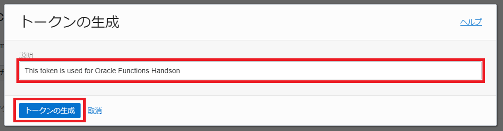

「コピー」テキストをクリックして、クリップボードにコピーします。コピーした内容は、テキストエディタなどにペーストしてください。
「閉じる」ボタンをクリックします。

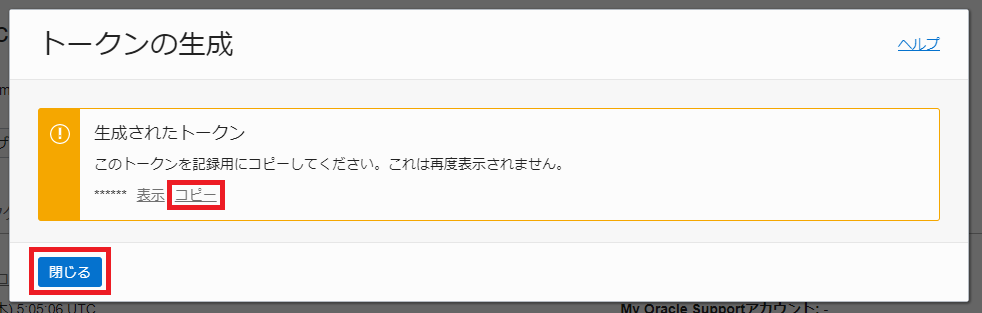

### 1-3.オブジェクト・ストレージ・ネームスペースの確認

画面右上の人型のマークが表示されている箇所をクリックします。さらに、展開されたメニューのテナンシ部分をクリックします。

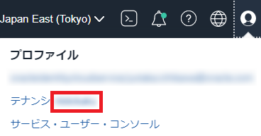

「オブジェクト・ストレージ・ネームスペース」をコピーして、テキストエディタなどにペーストしてください。

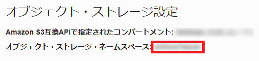

### 1-4.Oracle Functions CLI contextの作成と設定確認

Oracle FunctionsをデプロイするためのにOracle Functions CLIを利用して環境を作成します。開発環境の設定は、fn updateコマンドを使用して行います。

最初に、Cloud Shell CLIを起動します。画面上部の「Cloud Shell」アイコンをクリックします。


画面下方にコンソールが起動します。

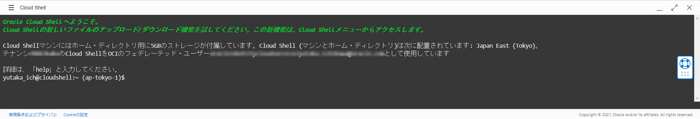


以下のコマンドを実行し、今選択されているcontextを確認します。`ap-tokyo-1 ` に「*」が付いていれば問題ありません。

```sh
fn list context
```
***コマンド結果***
```sh
CURRENT NAME            PROVIDER        API URL                                                 REGISTRY
*       ap-tokyo-1      oracle-cs       https://functions.ap-tokyo-1.oci.oraclecloud.com        nrt.ocir.io/<object-storage-namespace>/functions-handson-<ご自身の苗字>/
        default         oracle-cs
```

もし`ap-tokyo-1` に「*」が無い場合は、以下の手順を実行してください。

```sh
fn use context ap-tokyo-1 
```

以下のコマンドを実行し、コンパートメントIDを設定します。
`[compartment-ocid]` には、テキストエディタにペーストしたOCIDを入力します。


```sh
fn update context oracle.compartment-id [compartment-ocid]
```
***コマンド結果***
```sh
Current context updated oracle.compartment-id with ocid1.compartment.oc1..xxxxxxxxxx
```

以下のコマンドを実行し、OCIRを設定します。
`[オブジェクト・ストレージ・ネームスペース]` には、テキストエディタにペーストしたオブジェクト・ストレージ・ネームスペースを入力します。

```sh
fn update context registry nrt.ocir.io/[オブジェクト・ストレージ・ネームスペース]/functions-handson-<ご自身の苗字>
```
***コマンド結果***
```sh
Current context updated registry with nrt.ocir.io/<object-storage-namespace>/functions-handson-<ご自身の苗字>
```

以下のコマンドを実行し、Oracle Functionsで使用するprofile名を設定します。
profile名は、今回 `DEFAULT`(OCI CLIセットアップ時に設定されるデフォルトのprofile名)を入力します。

```sh
fn update context oracle.profile "DEFAULT"
```
***コマンド結果***
```sh
Current context updated oracle.profile with DEFAULT
```

以下のコマンドを実行し、OCIRにログインできることを確認します。(本ハンズオンでは、ap-tokyo-1を使用しているので、”nrt”としています。)   ログインの際にユーザー名とパスワードを要求されます。
「Username」を確認します。

プロファイル名がユーザ名になります。  
プロファイル名をクリックします。

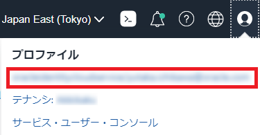

このプロファイル名をコピーして、テキストエディタ等にペーストしておきます。

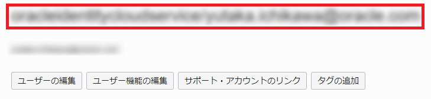

ログインする際にオブジェクト・ストレージ・ネームスペースと合わせて入力してください。

「＜object-storage-namespace＞/＜username＞」

「Password」はテキストエディタにペーストした認証トークンを入力してください。パスワードは入力時表示されません。

```sh
docker login nrt.ocir.io
```
***コマンド結果***
```sh
Username: ＜object-storage-namespace＞/＜username＞
Password: ＜作成した認証トークン＞
WARNING! Your password will be stored unencrypted in /home/yutaka_ich/.docker/config.json.
Configure a credential helper to remove this warning. See
https://docs.docker.com/engine/reference/commandline/login/#credentials-store

Login Succeeded
```

### 1-5.仮想クラウド・ネットワークの作成

Functionsで利用する仮想クラウド・ネットワークを作成します。
画面左上にあるハンバーガーメニューをクリックして、「ネットワーキング」-「仮想クラウド・ネットワーク」を選択します。

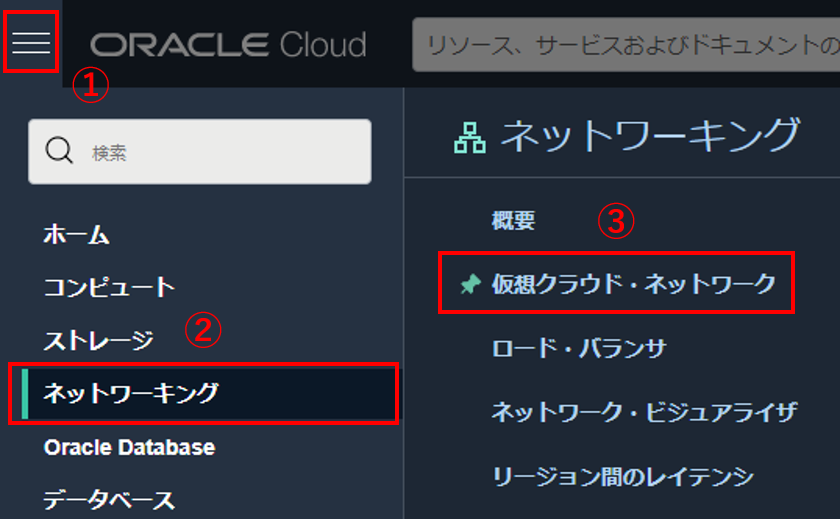

コンパートメントが「hands-on-<ご自身の苗字>」になっていることを確認します。なっていない場合は、プルダウンメニューから選択してください。

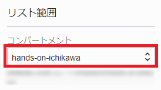

「VCNウィザードの起動」ボタンをクリックします。

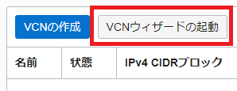

「インターネット接続性を持つVCNの作成」が選択されていることを確認して、「VCNウィザードの起動」ボタンをクリックします。

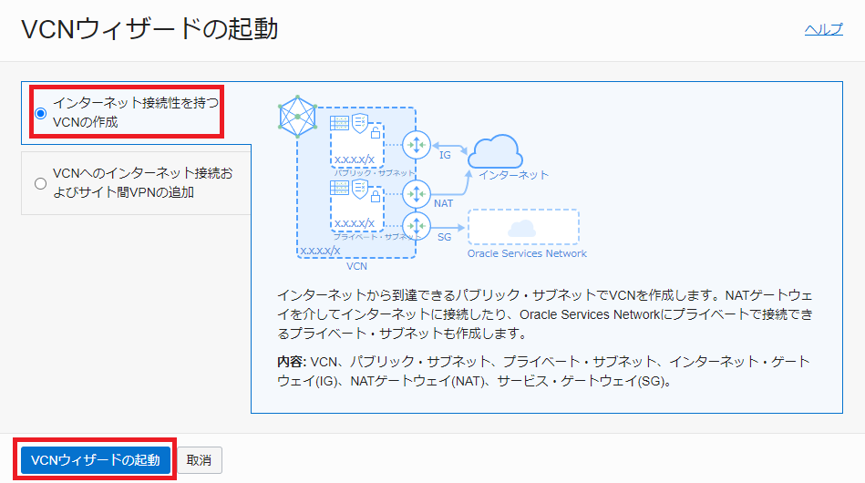

基本情報で以下を設定します。

* VCN名：任意の名前(ここでは”Oracle Functions Handson”とします。)
* コンパートメント：hands-on-＜ご自身の苗字＞

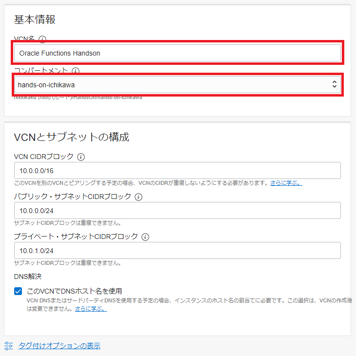

左下の「次へ」ボタンをクリックします。

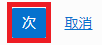

左下の「作成」ボタンをクリックします。

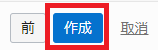

仮想クラウド・ネットワークの作成が完了したことを確認します。

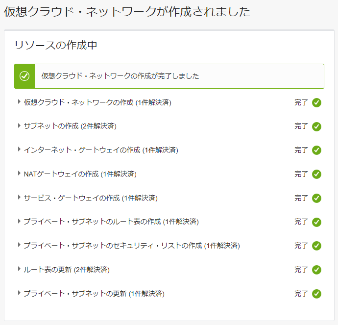

左下の「仮想クラウド・ネットワークの表示」ボタンをクリックします。


もし、以下の画面表示となった場合は、「here」をクリックしてください。

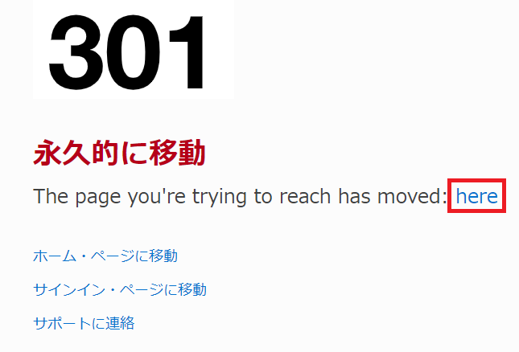

以下VCNができていることを確認します。

* パブリック・サブネット-Oracle Functions Handson
* プライベート・サブネット-Oracle Functions Handson

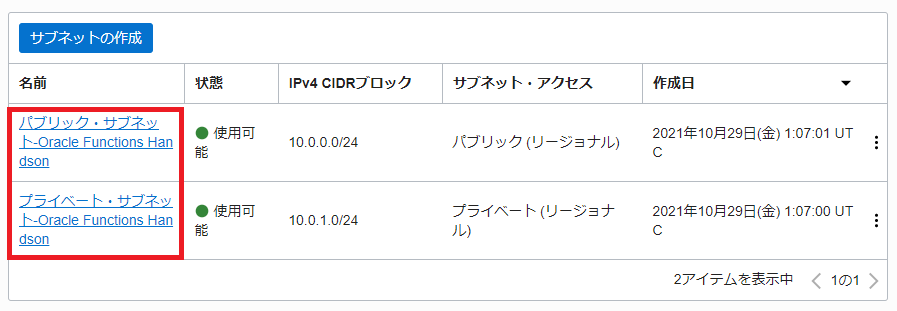

以上で、仮想クラウド・ネットワークの作成は完了です。

### 1-6.Functions 実行環境作成

Functionsの実行環境を作成します。
画面左上にあるハンバーガーメニューをクリックして、「開発者サービス」-「アプリケーション」を選択します。

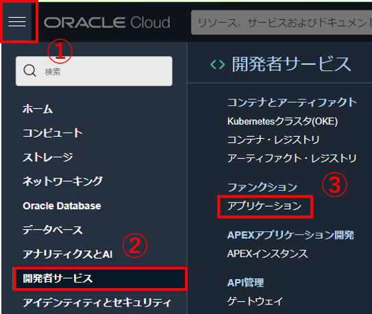

コンパートメントが「hands-on-<ご自身の苗字>」になっていることを確認します。なっていない場合は、プルダウンメニューから選択してください。


「アプリケーションの作成」ボタンをクリックします。


以下の設定をします。

名前：helloworld-app
Hands-on-＜ご自身の苗字＞のVCN：Oracle Functions Handson
Hands-on-＜ご自身の苗字＞のサブネット：パブリック・サブネットOracle Functions Handson(リージョナル)

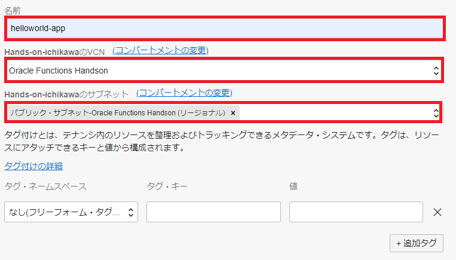

左下の「作成」ボタンをクリックします。

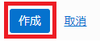

以上で、Functions 実行環境の構築は完了です。

### 1-7.コンピュートの作成

ハンズオンで使用する仮想マシンインスタンスを作成します。

画面左上にあるハンバーガーメニューをクリックして、「コンピュート」-「インスタンス」を選択します。


コンパートメントが「hands-on-<ご自身の苗字>」になっていることを確認します。なっていない場合は、プルダウンメニューから選択してください。


「インスタンスの作成」ボタンをクリックします。


「Shape」の「Change Shape」ボタンをクリックします。

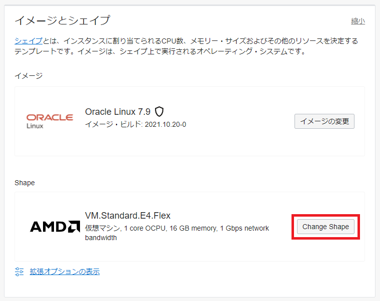

「シェイプ・シリーズ」で「Intel」を選択して、「VM.Standard2.1」にチェックを入れて、「シェイプの選択」ボタンをクリックします。

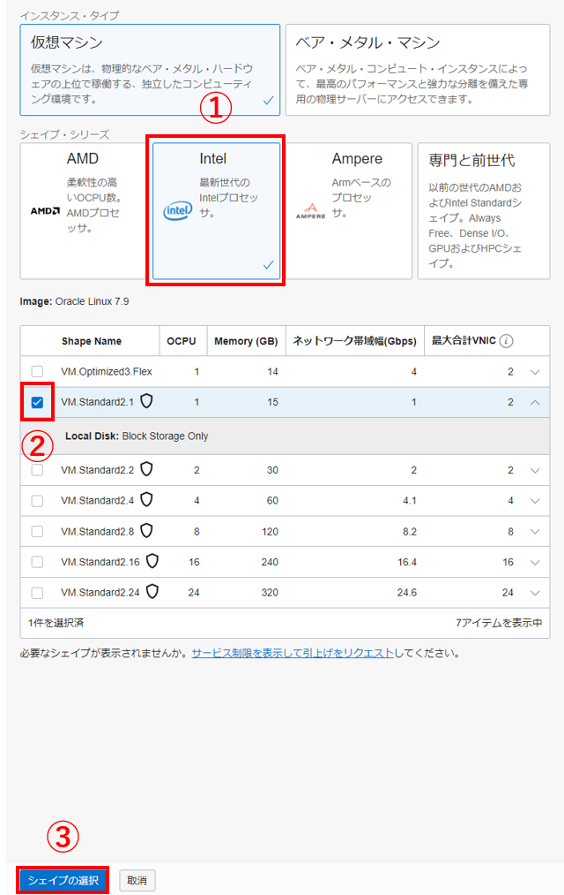

「hands-on-＜ご自身の苗字＞の仮想クラウド・ネットワーク」が、`Oracle Functions Handson`、「hands-on-＜ご自身の苗字＞のサブネット」が、`パブリック・サブネット-Oracle Functions Handson(リージョナル)` となっていることを確認します。

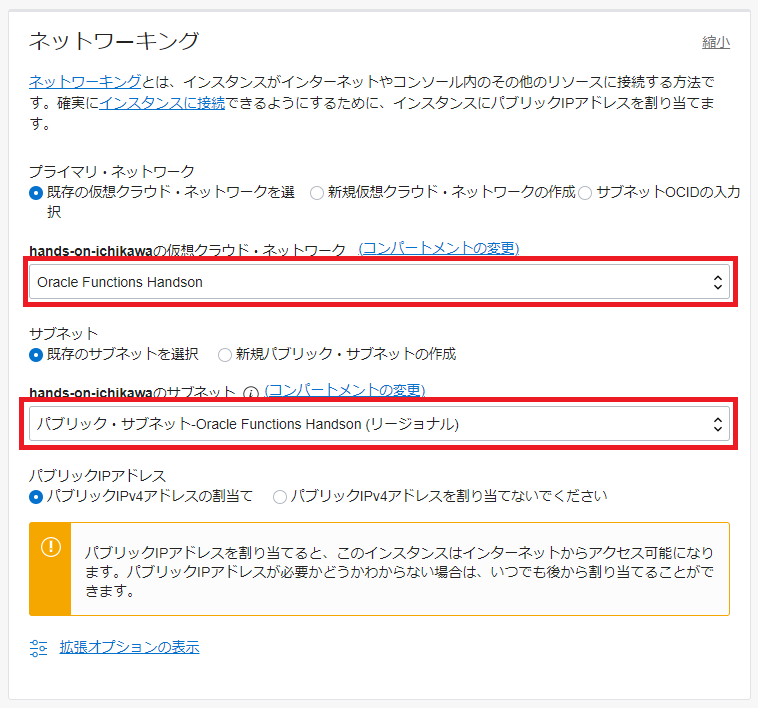

「SSHキーの追加」で「秘密キーの保存」ボタンをクリックして、キーをダウンロードします。


「作成」ボタンをクリックして、コンピュートを作成します。


「実行中」であることを確認ます。「パブリックIPアドレス」をコピーして、テキストエディタにペーストしておきます。


Cloud Shellから作成したコンピュートインスタンスにSSH接続します。最初に、ダウンロードした「秘密キー」をCloud Shellにアップロードします。

Cloud Shellのハンバーガーメニューをクリックして、「アップロード」を選択します。


「コンピュータから選択」リンクテキストをクリックして、ダウンロードした秘密キー「sssh-key-2021-xx-xx.key」ファイルを選択します。そして、「アップロード」ボタンをクリックします。

左上に表示されるダイアログは、「非表示」テキストリンクをクリックすると非表示できます。

ホームディレクトリに「秘密キー」がアップロードされるので、以下コマンドを実行して、コンピュートインスタンスにログインします。接続するIPアドレスは、事前に確認したパブリックIPアドレスを利用してください。  「Are you sure you want to continue connecting (yes/no)?」には、「yes」と入力してください。

```sh
chmod 400 ./ssh-key-2021-xx-xx.key
```
```sh
ssh -i ./ssh-key-2021-xx-xx.key opc@xx.xx.xx.xx
```
***コマンド結果***
```sh
The authenticity of host 'xx.xx.xx.xx (xx.xx.xx.xx)' can't be established.
ECDSA key fingerprint is SHA256:xu6Nv2aitxGnOm1pQUj3HgMwLLxExdLocD0QamFQCp8.
ECDSA key fingerprint is MD5:c7:59:36:0d:7a:60:9b:79:ef:85:a2:86:39:80:63:4d.
Are you sure you want to continue connecting (yes/no)? yes
Warning: Permanently added 'xx.xx.xx.xx' (ECDSA) to the list of known hosts.
```

一度ログアウトします。

```sh
exit
```
***コマンド結果***
```
logout
Connection to xx.xx.xx.xx closed.
```
後ほど、このコンピュートインスタンスで作業します。  
これでコンピュートインスタンスの作成とログインは完了となります。

事前準備が完了しました。  
以下のページにアクセスしてください。  
サーバレスアプリケーションが構築に挑戦します。

https://oracle-japan.github.io/ocitutorials/cloud-native/functions-apigateway-for-beginners/

上記ハンズオンページにおいて、以下読み替える必要があります。

## 読み替え及び追加作業箇所

### 【読み替え箇所】2.OCI API Gatewayプロビジョニングの事前準備【】

#### 【読み替え箇所】2-1.イングレス・ルールの追加

イングレスルール追加は、以下に読み替えてください。

* コンパートメント: hands-on-＜ご自身の苗字＞
* VCN: Oracle Functions Handson

#### 【読み替え箇所】2-2.動的ポリシーの作成

名前：api_gw_grp_＜ご自身の苗字＞

<hr>

ポリシー・ビルダー：以下のポリシーを入力します。

```sh
Allow dynamic-group api_gw_grp_＜ご自身の苗字＞ to use functions-family in compartment hands-on-＜ご自身の苗字＞
```

### 【読み替え箇所】3.OCI API GatewayへのOracle Functionsデプロイと動作確認

#### 【読み替え箇所】3-1.OCI API Gatewayの作成

HANDS-ON-＜ご自身の苗字＞の仮想クラウド・ネットワーク：Oracle Functions Handson

HANDS-ON-＜ご自身の苗字＞のサブネット：パブリック・サブネット-Oracle Functions Handson

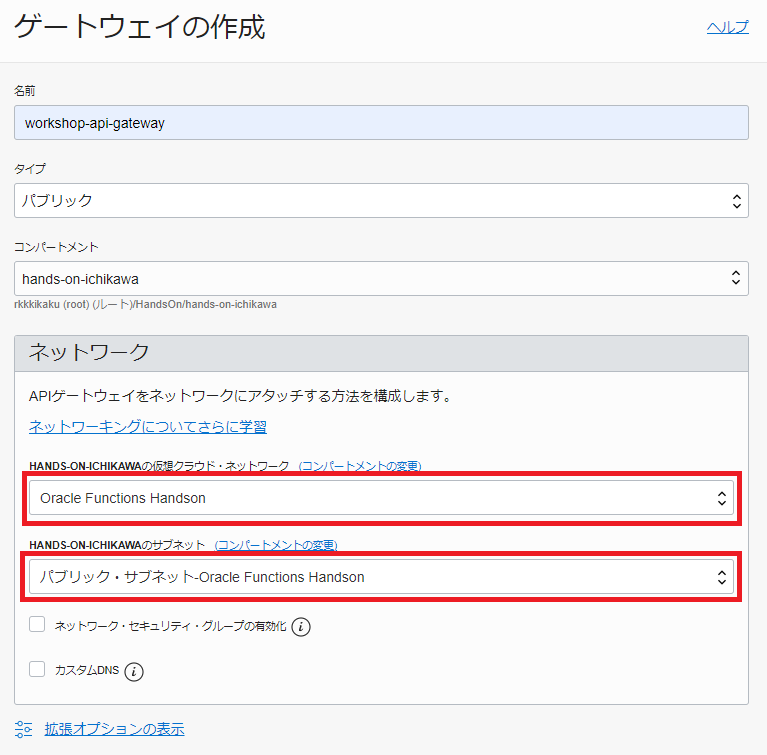

#### 【読み替え箇所】3-3.動作確認

ここでは最初に、事前準備で作成したコンピュートインスタンスにログインしてから進めてください。
一度ホームディレクトリに戻ってから実行します。

```sh
cd ~
```

```sh
ssh -i ./ssh-key-2021-xx-xx.key opc@xx.xx.xx.xx
```

イングレスルール追加は、以下に読み替えてください。

* コンパートメント: hands-on-＜ご自身の苗字＞
* VCN: Oracle Functions Handson

# Day1ハンズオン

## 1.削除処理

### 1-1 コンピュートインスタンスの削除

画面左上にあるハンバーガーメニューをクリックして、「コンピュート」-「インスタンス」を選択します。

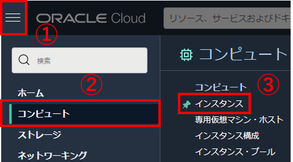

プルダウンメニューから「終了」を選択します。

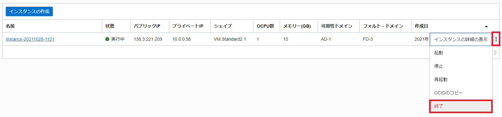

「アタッチされたブート・ボリュームを完全に削除」にチェックを入れて、「インスタンスの終了」ボタンをクリックします。

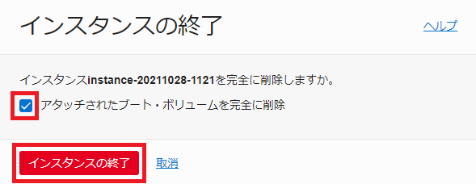

コンピュートインスタンスの削除は完了です。

### 1-2 動的グループとポリシーの削除

画面左上にあるハンバーガーメニューをクリックして、「アイデンティティとセキュリティ」-「動的グループ」を選択します。

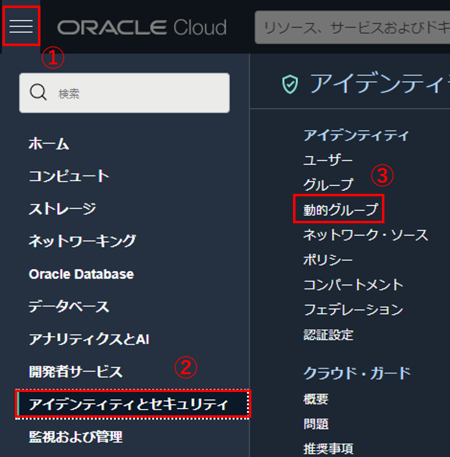

リストから「hands-on-＜ご自身の苗字＞」、右端にあるプルダウンメニューから「削除」を選択します。

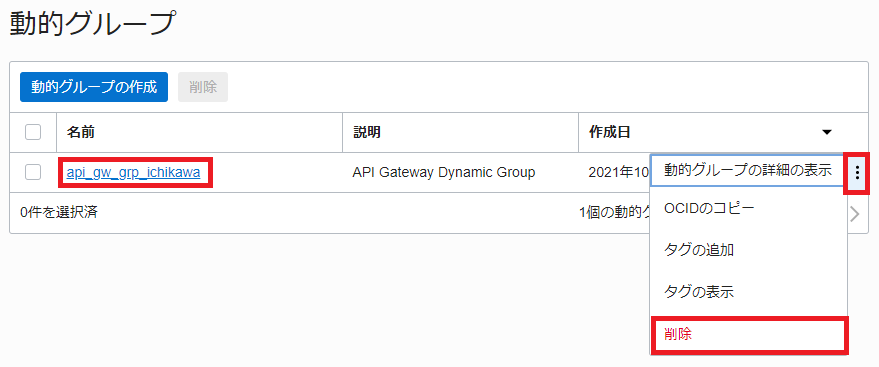

「削除」ボタンをクリックします。

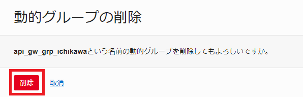

「ポリシー」を選択します。

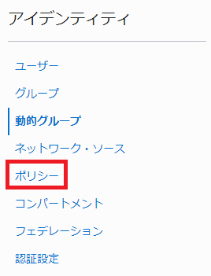

リストから「APIGW_Policy」の右端にあるプルダウンメニューから「削除」を選択します。

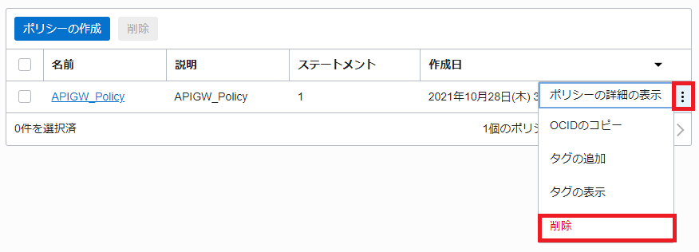

「削除」ボタンをクリックします。


動的グループとポリシーの削除は完了です。

### 1-3 API Gatewayの削除

画面左上にあるハンバーガーメニューをクリックして、「開発者サービス」-「ゲートウェイ」を選択します。

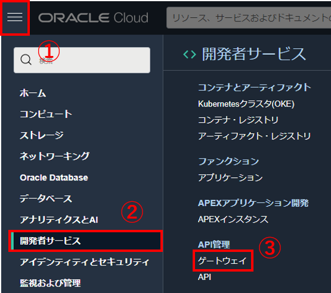

リストにある「workshop-api-gateway」を選択します。

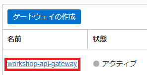

「デプロイメント」を選択します。

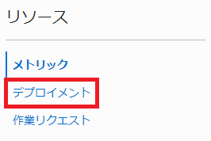

リストにある「workshop-api-deployment」の右端にあるプルダウンメニューから「削除」を選択します。

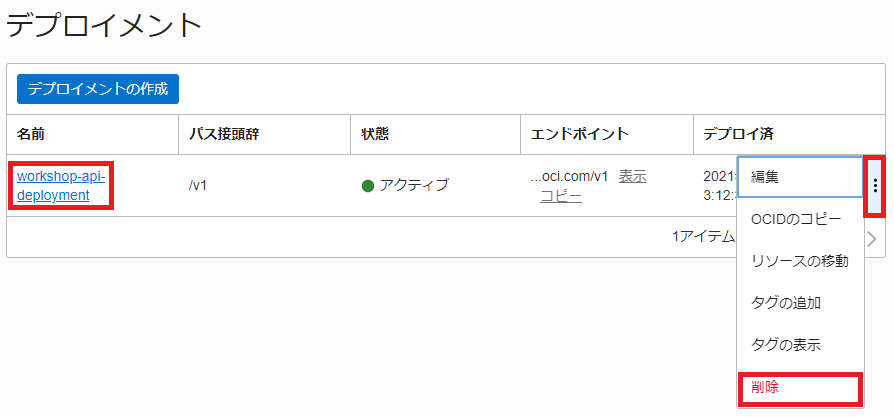

「削除」ボタンをクリックします。

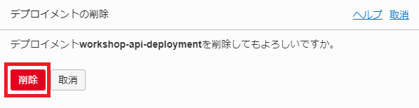

左上のぱんくずりすとから「ゲートウェイ」を選択します。

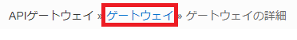

リストにある「workshop-api-gateway」の右端にあるプルダウンメニューから「削除」を選択します。

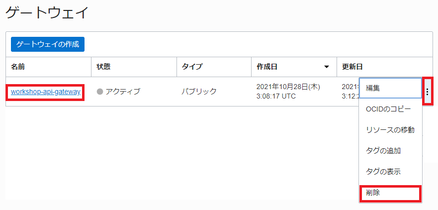

「削除」ボタンをクリックします。


API Gatewayの削除は完了です。

### 1-4 Functionsの削除

画面左上にあるハンバーガーメニューをクリックして、「開発者サービス」-「アプリケーショ」を選択します。

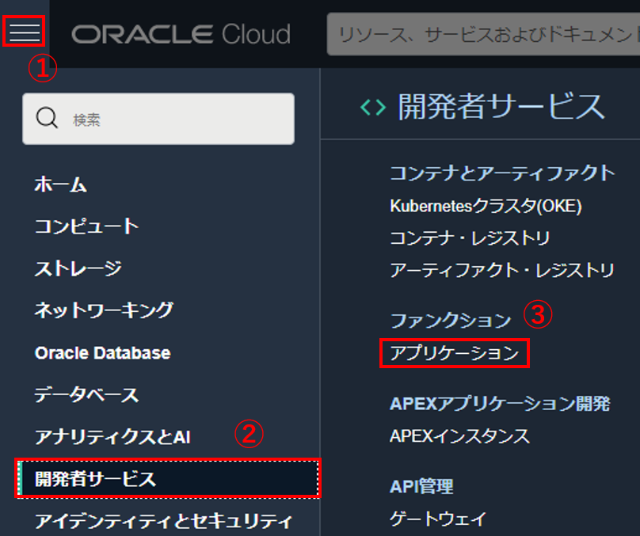

リストにある「hellowordl-app」の右端にあるプルダウンメニューから「削除」を選択します。

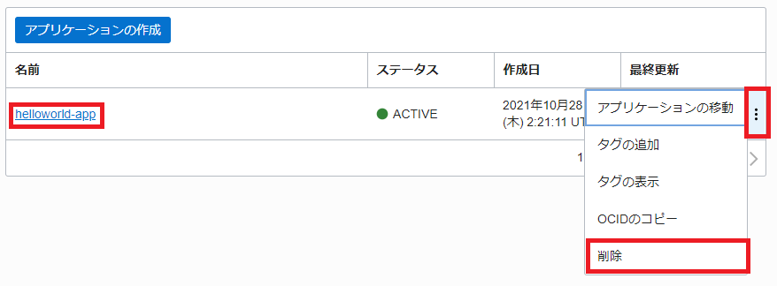

「DELETE HELLOWORLD-APP」と入力して、「削除」ボタンをクリックします。

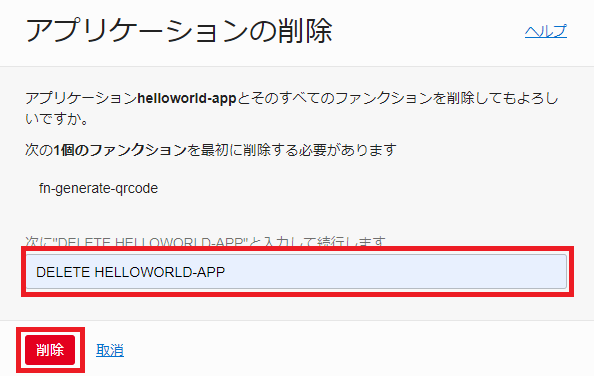

Functionsの削除は完了です。

### 1-5 仮想クラウド・ネットワークの削除

画面左上にあるハンバーガーメニューをクリックして、「ネットワークキング」-「仮想クラウド・ネットワーク」を選択します。

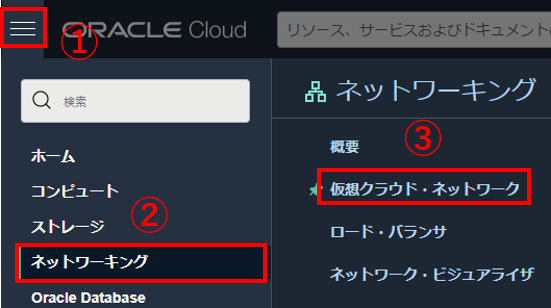

リストにある「Orale Functions Handson」の右端にあるプルダウンメニューから「終了」を選択します。

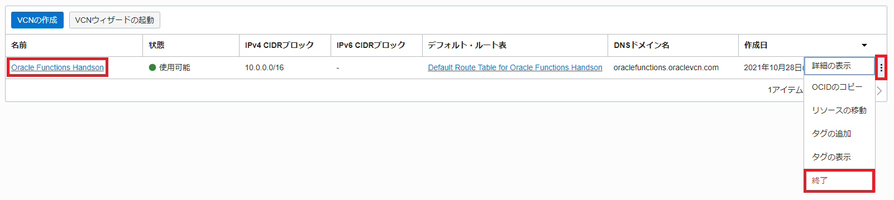

「すべて終了」ボタンをクリックします。

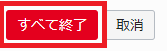

「閉じる」ボタンをクリックします。


仮想クラウド・ネットワークの削除は完了です。

## 2-6 認証トークンの削除

画面右上の人型のマークが表示されている箇所をクリックします。さらに、展開されたメニューのユーザー名部分をクリックします。


画面左下にある「認証トークン」をクリックします。


リストにある「This token is used for Oracle Functions Handson」の右端にあるプルダウンメニューから「削除」を選択します。

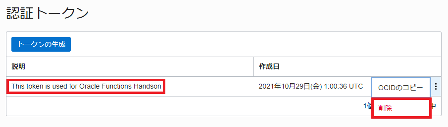

「削除」ボタンをクリックします。

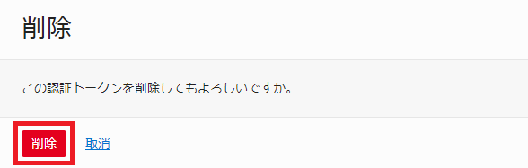

認証トークンの削除は完了です。

## 2-7 コンテナレジストリ（リポジトリ）の削除

ご自身のコンテナレジストリのリポジトリを削除します。  
画面左上にあるハンバーガーメニューをクリックして、「開発者サービス」-「コンテナ・レジストリ」を選択します。

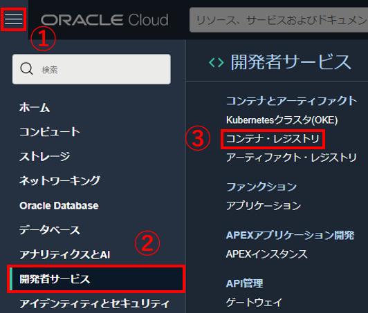

ルートコンパートメントを選択します。

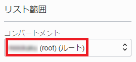

「functions-handson-＜ご自身の苗字＞/fn-generate-qrcode」を選択して、プルダウンメニューから「リポジトリの削除」を選択します。

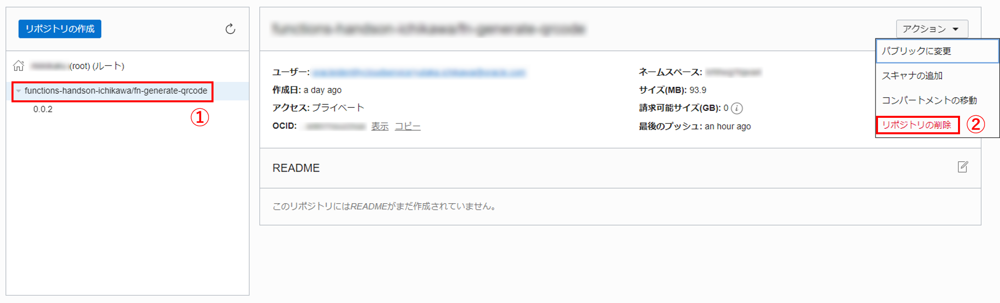

「削除」ボタンをクリックします。

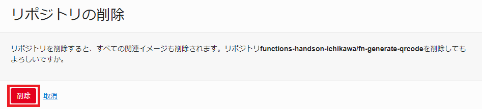

コンテナレジストリ（リポジトリ）の削除は完了です。

## 2-8 Object Storage(API Gatewayのログファイル格納場所)の削除

ハンズオン中にAPI Gatewayを作成しましたが、API Gatewayへのアクセスログが自動的にObject Storageのバケットに出力されるようになっています。  
このバケットを削除します。  
画面左上にあるハンバーガーメニューをクリックして、「開発者サービス」-「コンテナ・レジストリ」を選択します。

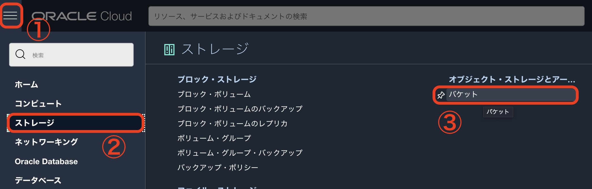

コンパートメントが「hands-on-<ご自身の苗字>」になっていることを確認します。なっていない場合は、プルダウンメニューから選択してください。


リストにあるバケット(名前はランダムに作成されています)の右端にあるプルダウンメニューから「削除」を選択します。

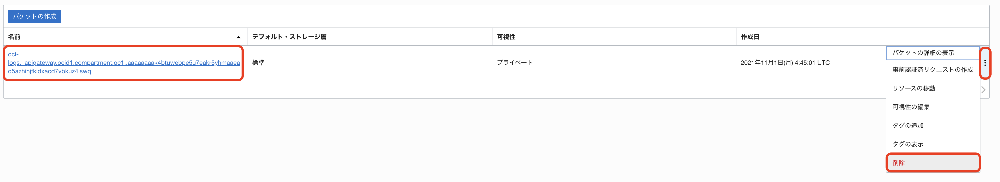

バケット名を入力し、「削除」をクリックします。

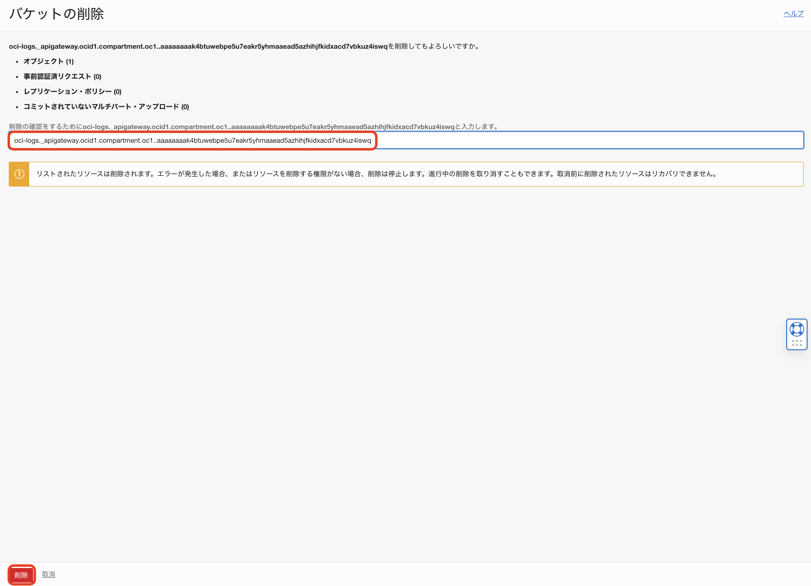

Object Storage(API Gatewayのログファイル格納場所)の削除は完了です。

## 2-9 資材の削除

git cloneやダウンロードした資材を削除します。

```sh
cd ~
```
```sh
ls
```
コマンド結果
```sh
apigw-functions-handson  ssh-key-2021-10-29.key
```

```sh
rm -rf ./*
```

資材の削除は完了です。

# Day2ハンズオン

Day2のハンズオンは、以下リンク先のページに従って行いますので、ページにアクセスしてください。

https://oracle-japan.github.io/ocitutorials/cloud-native/oke-for-advances/

## 読み替え及び追加作業箇所

### 【読み替え箇所】5.OCI MonitoringのメトリクスをGrafanaダッシュボードを利用して確認してみよう【オプション】

#### 【読み替え箇所】5-1 動的グループとポリシーの設定

動的グループの名前と説明は、以下にします。

名前: grafana_dynamic_group_＜ご自身の苗字＞

説明: grafana_dynamic_group_＜ご自身の苗字＞

#### 【読み替え箇所】5-3 Grafanaダッシュボードの確認

リージョンを変更する必要があります。

Default Region: ap-tokyo-1

### 【読み替え箇所】6.OCI APMを利用してトレーシングしてみよう【オプション】

#### 【読み替え箇所】6-1 ポリシーの作成

本ハンズオン環境では、このポリシー設定は不要です。

# Day2ハンズオン

## 削除処理

### 1-1 ロードバランサの削除

CloudShellで以下のコマンドを実行します。

```sh
kubectl delete service istio-ingressgateway -n istio-system
```
コマンド結果
```sh
service "istio-ingressgateway" deleted
```

### 1-2 Kubernetesクラスタの削除

画面左上にあるハンバーガーメニューをクリックして、「開発者サービス」-「Kubernetesクラスタ(OKE)」を選択します。

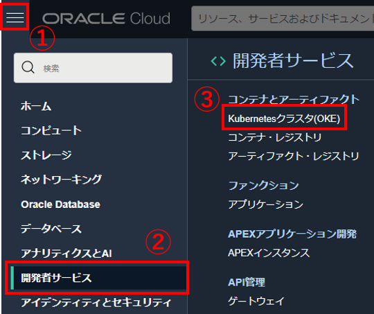

リストにある「cluster1」の右端にあるプルダウンメニューから「削除」を選択します。

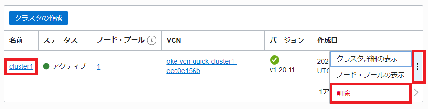

「cluster1」と入力して、「削除」ボタンをクリックします。

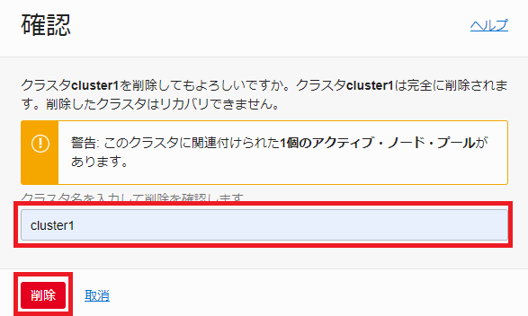

数分かかります。完全にKubernetesが削除されてから次のVCN削除を行ってください。

### 1-3 仮想クラウド・ネットワークの削除

画面左上にあるハンバーガーメニューをクリックして、「ネットワークキング」-「仮想クラウド・ネットワーク」を選択します。


リストにあるVCNの右端にあるプルダウンメニューから「終了」を選択します。

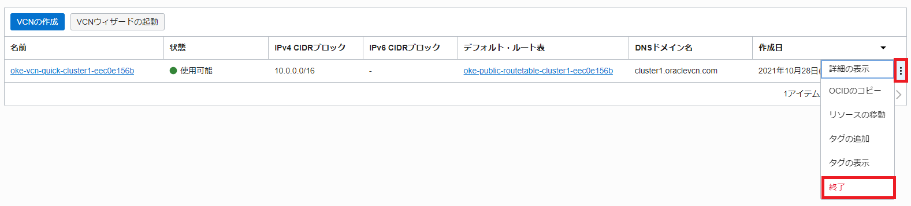

「すべて終了」ボタンをクリックします。


「閉じる」ボタンをクリックします。


仮想クラウド・ネットワークの削除は完了です。

### 1-4 動的グループとポリシーの削除

この作業は「5.OCI MonitoringのメトリクスをGrafanaダッシュボードを利用して確認してみよう【オプション】」を実施した場合に行ってください。  
画面左上にあるハンバーガーメニューをクリックして、「アイデンティティとセキュリティ」-「動的グループ」を選択します。


リストにあるま「grafana_dynamic_group_＜ご自身の苗字＞」の右端にあるプルダウンメニューから「削除」を選択します。

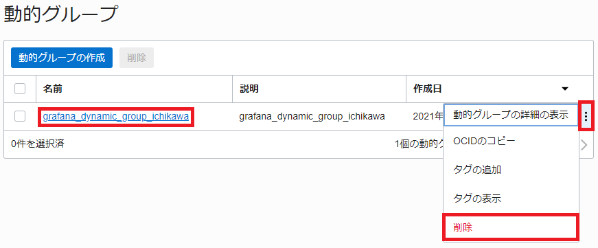

「削除」ボタンをクリックします。

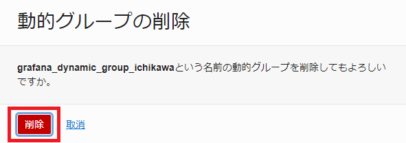

「ポリシー」を選択します。


リストから「grafana_policy」の右端にあるプルダウンメニューから「削除」を選択します。

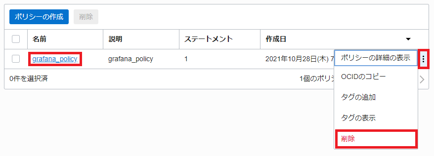

「削除」ボタンをクリックします。

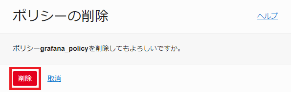

動的グループとポリシーの削除は完了です。

### 1-5 APMドメインの削除

この作業は「6.OCI APMを利用してトレーシングしてみよう【オプション】」を実施した場合に行ってください。  
画面左上にあるハンバーガーメニューをクリックして、「監視および管理」-「管理」を選択します。

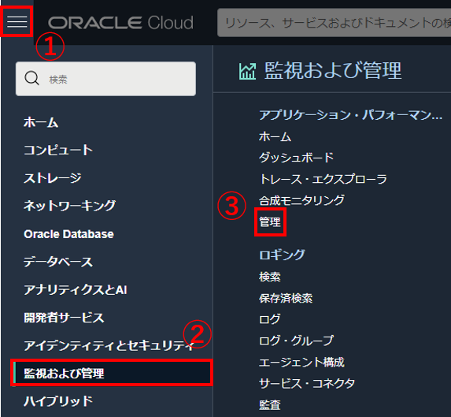

リストにある「oke-handson-apm」の右端にあるプルダウンメニューから「APMドメインの削除」を選択します。

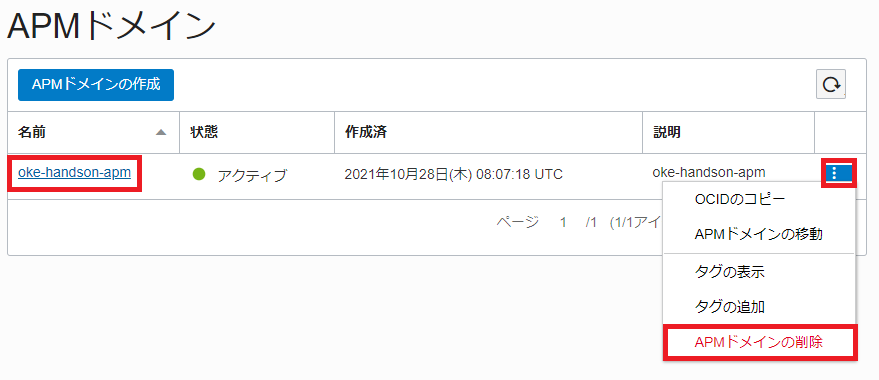

「oke-handson-apm」と入力して、「削除」ボタンをクリックします。

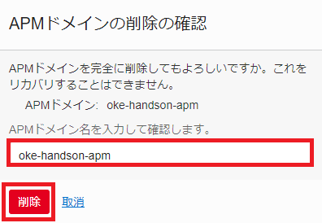

APMドメインの削除は完了です。

## 1-6 資材の削除

git cloneやダウンロードした資材を削除します。

```sh
cd ~
```
```sh
ls
```
コマンド結果
```sh
code-at-customer-handson  istio-1.11.0
```

```sh
rm -rf ./*
```

資材の削除は完了です。